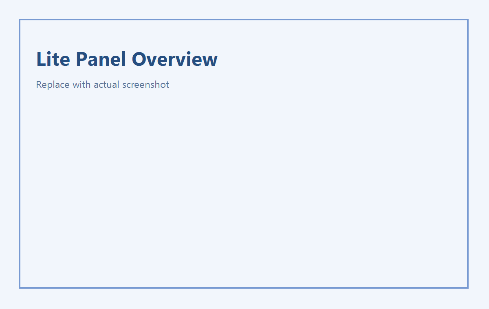
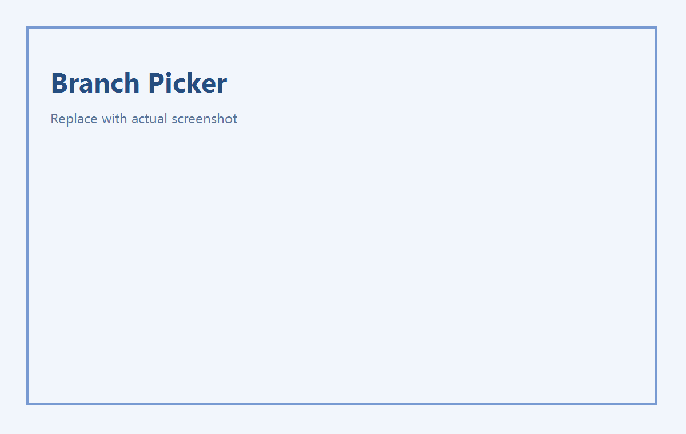

# ChatGPT Conversation Navigator
# CHatGPT对话导航栏

这个插件是我用来解决 ChatGPT 长对话“找上下文麻烦、回看麻烦、分叉继续麻烦”的问题。

目标很直接：
- 先把长对话整理成可读、可跳的结构。
- 再把关键回复打成节点，快速开分支继续聊。
- 整体尽量轻量，不打断当前阅读流。

## 功能清单

### 1) 轻量模式（默认）
- 小眼睛入口 + 问题栏。
- 扫描当前会话消息，显示总消息与提问数。
- 列表按“你说（主行）+ ChatGPT（子行）”分组。
- 搜索支持中文输入法（IME）正常输入。
- 顶部/底部快捷跳转。
- 中心跟随高亮：滚动正文时，问题栏自动高亮当前中心对应提问（带动画）。

### 2) 极简模式
- 按钮：`展开 / 顶部 / 底部 / 上 / 下`。
- `上/下` 只在“我的提问”之间跳转。
- 到边界会提示“已经到第一条/最后一条提问”。
- 悬浮胶囊支持拖拽。

### 3) 节点机制
- 只在 ChatGPT 回复旁显示 `设为节点`。
- 点击后变 `已设节点` 并常驻。
- 再点一次 `已设节点` 可取消节点。
- 问题栏子行用 `✦` 标识该回复已设节点。

### 4) 开分支机制
- 点击 `开分支` 时优先从已设节点里选起点。
- 有多个已设节点时弹出“选择开分支节点”动画菜单。
- 菜单编号与问题栏编号对齐（不会从 1 重新排）。
- 触发链路：目标消息 -> 更多操作 -> 新聊天中的分支。

## 效果图

### 轻量问题栏

### 节点标识（子行）

### 开分支节点选择菜单

### 极简模式

## 安装

1. 打开 `chrome://extensions/`
2. 开启“开发者模式”
3. 点击“加载已解压的扩展程序”
4. 选择本项目目录（有 `manifest.json`）
5. 打开 ChatGPT 页面并刷新

## 我自己的使用流程

1. 先点 `扫描`，确认列表和计数正常。
2. 关键回复点 `设为节点`。
3. 需要分叉讨论时点 `开分支`。
4. 对话很长时切极简模式，用 `上/下` 快速巡航。

## 已知限制

- “新聊天中的分支”依赖 ChatGPT 当前 DOM 与菜单结构，官方改版后可能要更新选择器。
- 分支本质是新会话，不是原会话内部真实分叉。
- 插件只做前端导航与辅助，不改 ChatGPT 服务端上下文。

## 目录说明

- `manifest.json`：Chrome MV3 配置
- `content.js`：核心逻辑（扫描、导航、节点、分支）
- `content.css`：界面样式与动画
- `lib/interact.min.js`：拖拽能力（interact.js）
- `docs/images/`：README 截图资源
