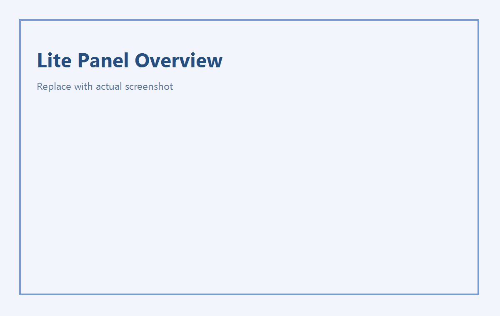
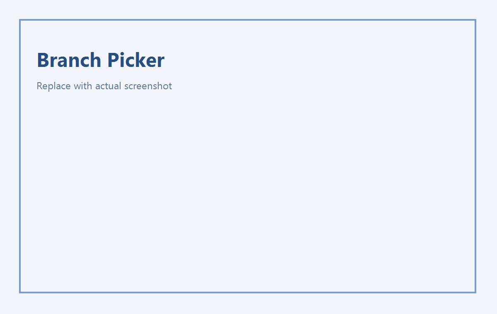

# ChatGPT Conversation Navigator（ChatGPT 对话导航栏）

这是一个面向 ChatGPT 网页的对话导航与会话管理扩展，用来解决两类常见问题：当前对话太长时难以定位上下文、回看和继续分支，以及历史聊天越来越多后难以筛选和批量整理。

插件提供两组核心能力：
- 在当前对话中扫描提问与回复，快速搜索、跳转、收口旧消息、标记关键节点并从指定回复开分支。
- 在会话管理器中查看未归档、已归档和已安排会话，按标题或时间筛选，并批量归档、恢复或删除聊天。
- 使用本地最小索引加快再次打开和同步速度，同时保留接口兼容性检查、二次删除确认和失败项重试等安全措施。
- 界面保持轻量，可在轻量问题栏与极简悬浮模式之间切换，尽量不打断正常阅读和对话。

## 功能清单

### 1) 轻量模式（默认）
- 小眼睛入口 + 问题栏。
- 扫描当前会话消息，显示总消息与提问数。
- 列表按“你说（主行）+ ChatGPT（子行）”分组。
- 搜索支持中文输入法（IME）正常输入。
- 顶部/底部快捷跳转。
- 中心跟随高亮：滚动正文时，问题栏自动高亮当前中心对应提问（带动画）。
- 长会话优化：`优化 / 恢复 / 保留10组|20组|30组` 一键收口旧消息（按问题栏分组计数）。
- 自动收口记忆：手动点一次 `优化` 后，当前会话会记住自动收口状态。
- 自动再收口：继续对话后消息增长到阈值，会自动再次收口，避免长会话越聊越卡。

### 2) 极简模式
- 按钮：`展开 / 顶部 / 底部 / 上 / 下`。
- `上/下` 只在“我的提问”之间跳转。
- 到边界会提示“已经到第一条/最后一条提问”。
- 悬浮胶囊支持拖拽。

### 3) 节点机制
- 只在 ChatGPT 回复旁显示 `设为节点`。
- 点击后变 `已设节点` 并常驻。
- 再点一次 `已设节点` 可取消节点。
- 问题栏子行用 `✦` 标识该回复已设节点。

### 4) 开分支机制
- 点击 `开分支` 时优先从已设节点里选起点。
- 有多个已设节点时弹出“选择开分支节点”动画菜单。
- 菜单编号与问题栏编号对齐（不会从 1 重新排）。
- 触发链路：目标消息 -> 更多操作 -> 新聊天中的分支。
- 如果目标节点消息已被收口，会提示“先恢复消息再开分支”。

### 5) 长会话收口规则
- 收口只处理“当前可见消息”，从最早对话组开始隐藏，严格保留最近数量（10/20/30 组）。
- 已设节点也参与收口，不做豁免；若节点超过保留数，只显示最近 N 组中的节点。
- `恢复` 会把收口消息按原位置插回，并尽量保持当前阅读位置不跳变。
- 自动记忆按“会话级”保存（每个会话独立），不做全局过期清理。

### 6) 会话批量管理
- 在问题栏底部点击 `会话管理`，读取当前 ChatGPT 网页账号下的普通聊天、项目聊天和“工作”模式聊天。
- 支持按最后更新时间筛选：`1 天前 / 1 周前 / 1 个月前 / 半年前`，也可按标题搜索。
- 支持逐条选择、多选或全选当前筛选结果；全选默认跳过置顶聊天和当前正在打开的聊天。
- 未归档聊天可以批量归档，已归档聊天可以恢复；永久删除必须再次确认。
- 自动化任务集中显示在 `已安排` 页，并通过独立任务列表读取，不会重复扫描普通聊天；该页不提供批量操作，请前往 ChatGPT 的“已安排”页面管理。
- 再次打开时先显示本地最小索引；`同步` 只增量检查最新变化，`全量` 用于校准其他设备产生的旧记录归档或删除。

## 效果图

### 轻量问题栏


### 节点标识（子行）


### 开分支节点选择菜单


### 极简模式


## 安装

1. 打开 `chrome://extensions/`
2. 开启“开发者模式”
3. 点击“加载已解压的扩展程序”
4. 选择本项目目录（有 `manifest.json`）
5. 打开 ChatGPT 页面并刷新

## 推荐使用流程

1. 先点 `扫描`，确认列表和计数正常。
2. 对话变长开始卡时，点 `优化`，保留值先用默认 `10`。
3. 关键回复点 `设为节点`；节点仍参与收口，点击 `恢复` 后可重新查看。
4. 需要分叉讨论时点 `开分支`。
5. 对话特别长时切极简模式，用 `上/下` 快速巡航。
6. 需要整理历史聊天时打开 `会话管理`，先按状态、时间或标题筛选，再选择归档、恢复或删除。

## 已知限制

- “新聊天中的分支”依赖 ChatGPT 当前 DOM 与菜单结构，官方改版后可能要更新选择器。
- 分支本质是新会话，不是原会话内部真实分叉。
- 会话批量管理及 `已安排` 列表依赖 ChatGPT 网页当前使用的内部接口；接口变化时插件会停止操作并提示，而不会退回到自动点击页面菜单或读取其他列表代替。
- 临时访问令牌、原始账号 ID 和完整账号响应只保存在当前页面内存中。扩展存储仅保存会话 ID、标题、时间和必要标记组成的最小索引，账号命名空间使用 SHA-256 摘要。
- 任一必要列表校验失败时，归档、恢复和删除都会被禁用；缓存只用于快速显示，`全量` 才是权威校准。
- 会话批量管理只覆盖 ChatGPT 网页（含“工作”模式），不管理 Codex 桌面应用中的任务。
- 插件中的“永久删除”采用 ChatGPT 网页当前的删除语义：向会话接口写入 `is_visible: false`，从可见历史中不可恢复地移除；这不等同于证明服务端已立即物理擦除数据。
- 删除操作无法从插件中撤销。执行批量删除前请仔细核对筛选条件和选中数量。

## 目录说明

- `manifest.json`：Chrome MV3 配置
- `content.js`：核心逻辑（扫描、导航、节点、分支）
- `conversation-manager-core.js`：会话标准化、时间筛选和安全选择规则
- `conversation-index-store.js`：按账号摘要隔离的本地最小会话索引
- `conversation-manager.js`：会话读取、批量操作和管理弹窗
- `content.css`：界面样式与动画
- `lib/interact.min.js`：拖拽能力（interact.js）
- `docs/images/`：README 截图资源

## 测试

```bash
node --test tests/*.test.js
```

测试使用本地假 Adapter，不会访问或修改真实 ChatGPT 聊天。
